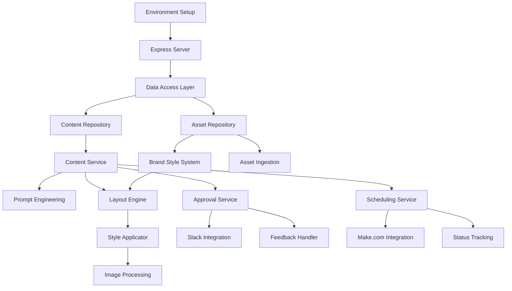

# Synapse Project Module Tracker

This document provides a high-level overview of the major modules in the Synapse project, their status, and development plans. It serves as a roadmap for development sessions with Claude.

## Core Infrastructure Modules

| Module | Status | Description | Priority | Est. Completion |
|--------|--------|-------------|----------|----------------|
| Environment Setup | ✅ Completed | Project structure, config, env variables | - | Completed |
| Express Server | ✅ Completed | Base server setup with middleware | - | Completed |
| Data Access Layer | ✅ Completed | Airtable integration and base repository pattern | - | Completed |

## Content Generation Pipeline

| Module | Status | Description | Priority | Est. Completion |
|--------|--------|-------------|----------|----------------|
| Content Repository | ✅ Completed | Repository implementation for content entities | HIGH | Completed |
| Content Service | 📝 Planned | Business logic for content generation | HIGH | Week 2 |
| Prompt Engineering | 📝 Planned | AI prompt generation and optimization | MEDIUM | Week 2-3 |
| OpenAI Integration | ✅ Completed | Service for AI text and image generation | - | Completed |

## Asset Management System

| Module | Status | Description | Priority | Est. Completion |
|--------|--------|-------------|----------|----------------|
| Asset Repository | ✅ Completed | Repository for brand assets and files | - | Completed |
| Brand Style System | 📝 Planned | Management of brand themes and styles | MEDIUM | Week 3 |
| Asset Ingestion | 📝 Planned | Upload, analysis, and processing of assets | MEDIUM | Week 3-4 |
| Cloudinary Integration | ✅ Completed | Service for image processing and storage | - | Completed |

## Text Overlay System

| Module | Status | Description | Priority | Est. Completion |
|--------|--------|-------------|----------|----------------|
| Layout Engine | 📝 Planned | Determines optimal text positioning | HIGH | Week 4 |
| Style Applicator | 📝 Planned | Applies brand styling to text | HIGH | Week 4 |
| Image Processing | 📝 Planned | Handles image manipulation with text | HIGH | Week 5 |

## Approval Workflow

| Module | Status | Description | Priority | Est. Completion |
|--------|--------|-------------|----------|----------------|
| Slack Integration | 📝 Planned | Sends content for review via Slack | LOW | Week 6 |
| Approval Service | 📝 Planned | Manages approval/revision processes | LOW | Week 6 |
| Feedback Handler | 📝 Planned | Processes feedback for revisions | LOW | Week 7 |

## Distribution System

| Module | Status | Description | Priority | Est. Completion |
|--------|--------|-------------|----------|----------------|
| Scheduling Service | 📝 Planned | Manages content posting schedule | LOW | Week 7 |
| Make.com Integration | 📝 Planned | Handles cross-platform distribution | LOW | Week 8 |
| Status Tracking | 📝 Planned | Monitors distribution status | LOW | Week 8 |

## API Layer

| Module | Status | Description | Priority | Est. Completion |
|--------|--------|-------------|----------|----------------|
| Brand Controller | ✅ Completed | API endpoints for brand management | - | Completed |
| Job Controller | ✅ Completed | API endpoints for job management | - | Completed |
| Content Controller | 📝 Planned | API endpoints for content management | HIGH | Week 1-2 |
| Approval Controller | 📝 Planned | API endpoints for approval workflow | LOW | Week 6 |
| Distribution Controller | 📝 Planned | API endpoints for content distribution | LOW | Week 7-8 |

## User Interface (Optional)

| Module | Status | Description | Priority | Est. Completion |
|--------|--------|-------------|----------|----------------|
| Admin Dashboard | ❓ Unplanned | Interface for content management | VERY LOW | TBD |
| Preview Panel | ❓ Unplanned | Visual content preview system | VERY LOW | TBD |
| Analytics View | ❓ Unplanned | Performance metrics and reporting | VERY LOW | TBD |

## Development Schedule

### Current Focus (March 2025)
- **Content Generation Foundation**
  - ✅ Complete Content Repository implementation
  - Begin Content Controller development
  - ✅ Set up initial tests for Content modules

### Next Phase (April 2025)
- **Content Creation & Styling**
  - Implement Content Service with AI integration
  - Develop core text-to-image prompting system
  - Complete Brand Style System integration

### Future Phases (Q2 2025)
- **Production & Distribution**
  - Build Text Overlay System
  - Implement basic approval workflows
  - Develop initial distribution integrations

## Module Dependencies

## Integration Points

- **Content Repository** → **Content Service** → **Prompt Engineering**
- **Brand Style System** → **Style Applicator** → **Image Processing**
- **Approval Service** → **Feedback Handler** → **Content Service**
- **Scheduling Service** → **Make.com Integration** → External platforms

## Decision Log

| Date | Decision | Rationale | Alternatives Considered |
|------|----------|-----------|-------------------------|
| 2025-03-12 | Use repository pattern | Provides abstraction over data sources | Direct data access, ORM |
| 2025-03-12 | Implement TDD workflow | Ensures code quality and testability | Manual testing, test-after |
| 2025-03-12 | Modular architecture | Enables independent development of components | Monolithic design |
| 2025-03-14 | Simplified workflow tooling | Improves development velocity with automated scripts | Manual workflow processes |
| 2025-03-14 | Focus on Content Generation first | Delivers core value proposition early | Building UI or distribution first |

## Implementation Priorities

1. **Content Generation Pipeline**
   - Focus on building robust content repository and generation capabilities
   - Complete OpenAI integration for text and image generation
   - Implement content storage and retrieval systems

2. **Brand & Styling System**
   - Enhance brand theme extraction and application
   - Build efficient text overlay capabilities
   - Create consistent visual styling across generated content

3. **Workflow Automation**
   - Develop approval processes with minimal manual intervention
   - Implement distribution scheduling and tracking
   - Integrate with external platforms through Make.com

## Development Principles

- **API-First Development**: Focus on robust API layer before UI components
- **Test-Driven Development**: Each module must have comprehensive tests
- **Modular Design**: Components should be independently deployable
- **Performance Monitoring**: Build with observability from the start
- **Security By Design**: Implement proper authentication and data protection